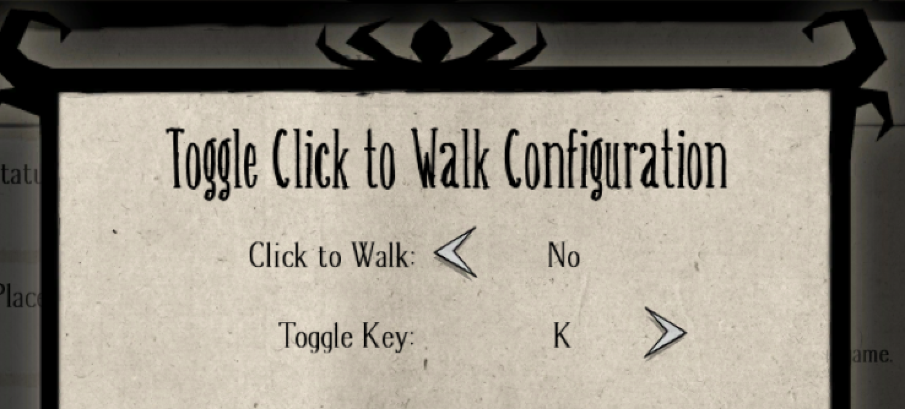

#Toggle Click to Walk - Don't Starve Together

Grants the player the ability to toggle between enable / disable click to walk functionality in-game.


Disabling the click to move will ONLY affect clicks “on the ground” - e.g. when you’re not targeting any entities. You can still click to perform any actions such as mining, picking, attacking, examining, etc. 

# Options

## Click to Walk


Tells whether click to walk will be working or not by default when joining a game
. Available options:

    Yes | No

## Toggle Key


Toggles the functionality in-game. Available options:

    K | L | ; | [ | ] | "Disabled"

You can chose to disable the ability to toggle if you like.

# Version Support

Currently only **Don't Starve Together** is supported.

Support for Don't Starve / Reign of Giants / Shipwrecked coming soon.

# Motivation

This mod was inspired by The Forge event when a lot of people seemed interested in this functionality. Although the event is over, it looks like some players don’t like this at all, even on regular DS/DST. 


Hope this mod can help improving your gameplay experience. As always any feedback is appreciated, enjoy!


# Links

* [Klei Forums Mod File](https://forums.kleientertainment.com/files/file/1788-toggle-click-to-walk/)
* [The Forge request thread](https://forums.kleientertainment.com/topic/84909-how-to-disable-click-to-walk/)